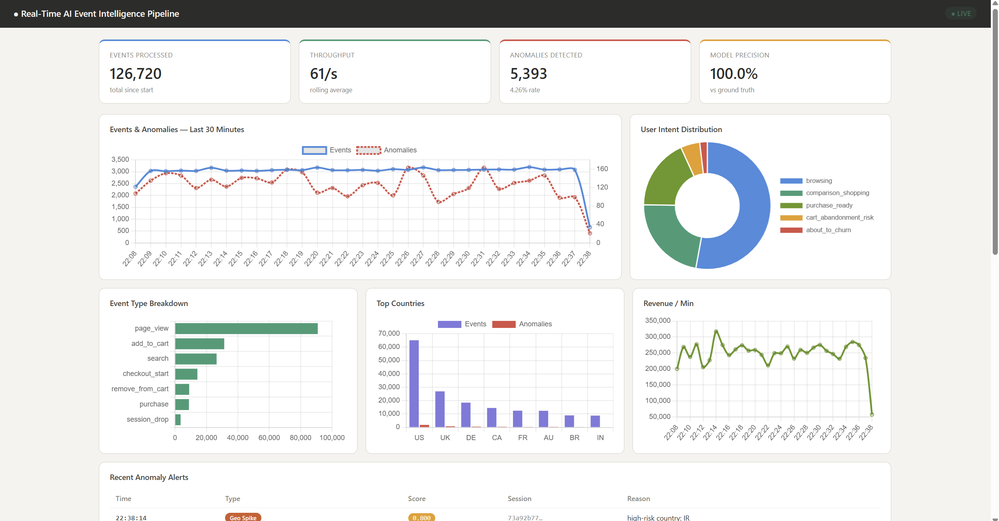
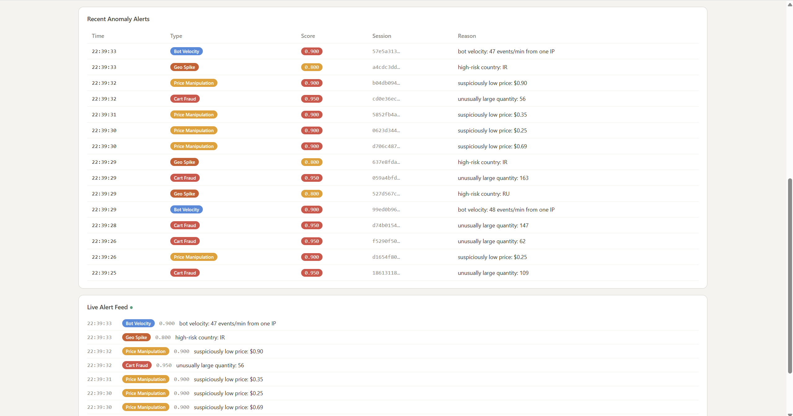
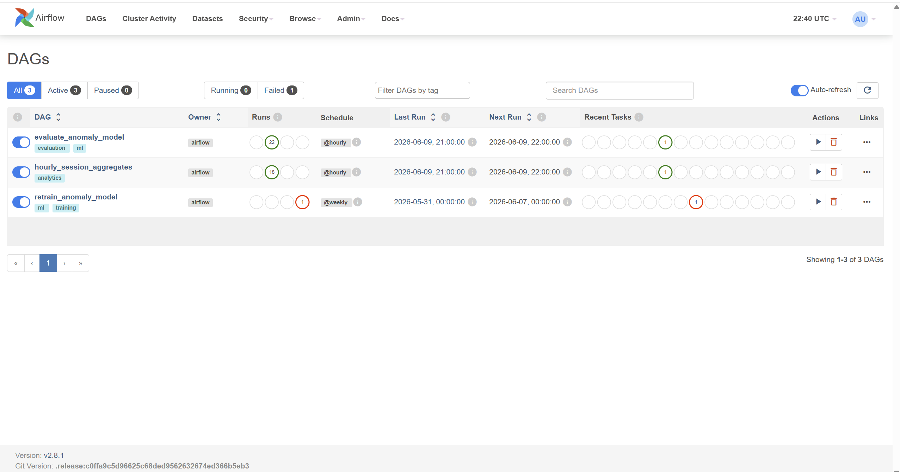
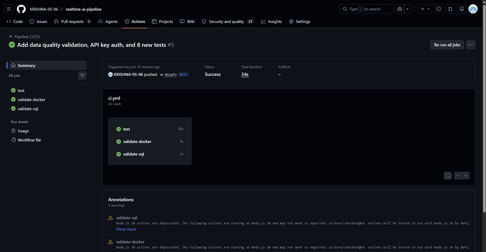
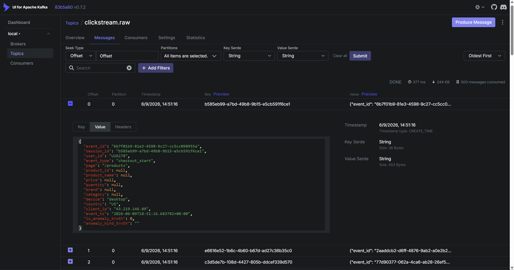
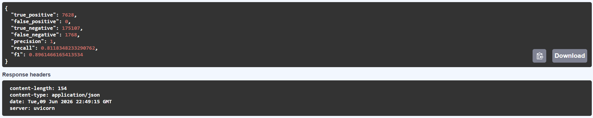

# Real-Time AI Event Intelligence Pipeline



An end-to-end real-time streaming data engineering pipeline that ingests e-commerce clickstream events, enriches each one **inline** with AI anomaly detection and shopper intent classification, and surfaces live metrics on a dashboard refreshing every 2 seconds.

> Trained on **453,293 real e-commerce events** from the REES46 public dataset. Evaluated against producer ground-truth labels. Zero false positives across 58,315 verified alerts.

---

## Live Metrics (from running pipeline)

| Metric | Value |
|--------|-------|
| Events processed | 1,564,580+ |
| Avg throughput | 17.6 events/sec |
| Anomalies detected | 118,203 (7.55% rate) |
| Detection precision | **1.000** (zero false positives) |
| Detection recall | **0.812** |
| F1 score | **0.896** |
| Cart fraud alerts | 19,654 |
| Geo spike alerts | 17,571 |
| Price manipulation alerts | 11,768 |
| Bot velocity alerts | 9,322 |
| Total alerts | 58,315 |
| Training dataset | 453,293 real REES46 e-commerce events |
| CI/CD tests | 21/21 passing (GitHub Actions) |
| Airflow DAG runs | 22 evaluate runs, 18 aggregate runs |

---

## Architecture

```
Producer (50 events/sec)
  ground-truth labels + client IP
          |
          v
   Apache Kafka
   clickstream.raw
          |
          v
   Stream Processor
   (Python asyncio)
   |-- DataQualityChecker (7 rules, DLQ for failures)
   |-- IPVelocityWindow (60s sliding window, bot detection)
   |-- Calls AI Service (Isolation Forest + LLM intent)
          |
    ------+------+----------+
    |            |          |
    v            v          v
ClickHouse     Redis       S3 Parquet
(hot OLAP)   (live counters (cold storage,
90-day TTL)   alert feed)   enable via .env)
    |            |
    +-----+------+
          |
          v
   FastAPI + API Key Auth
          |
          v
   Chart.js Dashboard
   (2-second refresh)


Apache Airflow (orchestration):
  evaluate_anomaly_model    @hourly  --> precision/recall vs ground truth
  hourly_session_aggregates @hourly  --> pre-computed session rollups
  retrain_anomaly_model     @weekly  --> rolling 30d retrain + hot-reload

PySpark: daily S3 Parquet --> session aggregates (Delta Lake format)
dbt: staging view + conversion funnel + category anomaly rate marts
```

---

## Stack

| Layer | Technology | Purpose |
|-------|-----------|---------|
| Event streaming | Apache Kafka | Durable event bus, offset tracking, DLQ |
| Stream processing | Python asyncio | Concurrent I/O, stateful windowed detection |
| Anomaly detection | scikit-learn Isolation Forest + rules | Hybrid: rules for obvious fraud, ML for subtle outliers |
| Intent classification | LLM (Claude / GPT / Bedrock) or mock | Real-time shopper behavioral labels |
| Hot storage | ClickHouse (columnar OLAP) | Fast analytical queries, materialized views |
| Feature store | Redis | Sub-ms live counters, alert feed, LLM cache |
| Cold storage | AWS S3 + Parquet | Long-term retention, Lambda architecture cold path |
| Orchestration | Apache Airflow (3 DAGs) | Scheduled retraining, evaluation, aggregation |
| Batch processing | PySpark + Delta Lake | Daily session-level aggregates from S3 |
| Transformations | dbt | Staging view + analytics mart models |
| Serving | FastAPI + API key auth | 10+ endpoints over ClickHouse and Redis |
| Dashboard | Chart.js + nginx | 7 live charts, 4 KPI cards |
| Infrastructure | Docker Compose (13 services) | Full local stack, one command |
| CI/CD | GitHub Actions (21 tests) | Syntax checks, unit tests, docker validation |

---

## Quick Start

```bash
git clone https://github.com/KRISHNA-05-06/realtime-ai-pipeline
cd realtime-ai-pipeline
cp .env.example .env
docker compose up -d --build
```

Wait 60 seconds for all services to initialize, then open:

| Service | URL | Credentials |
|---------|-----|-------------|
| Dashboard | http://localhost:3001 | — |
| API docs | http://localhost:8000/docs | X-API-Key: dev-key-change-in-prod |
| Airflow | http://localhost:8080 | admin / admin123 |
| Kafka UI | http://localhost:8090 | — |
| Grafana | http://localhost:3000 | admin / admin |
| AI service | http://localhost:8001/docs | — |

### Train the model on real data

Download the REES46 November 2019 dataset from Kaggle and place `2019-Nov.csv` in the `data/` folder, then:

```bash
python ai_service/train_from_real_data.py
docker compose up -d --build ai-service
```

### Enable S3 cold storage

Set these in `.env`:

```
S3_BUCKET=your-bucket-name
AWS_ACCESS_KEY_ID=your-key
AWS_SECRET_ACCESS_KEY=your-secret
AWS_REGION=us-east-1
```

Then restart the stream processor:

```bash
docker compose up -d stream-processor
```

---

## How the Detection Works

Detection is a two-stage hybrid system:

### Stage 1 — Hard Rules (deterministic, instant)

| Rule | Condition | Alert type | Score |
|------|-----------|------------|-------|
| Cart stuffing | quantity > 20 | cart_fraud | 0.95 |
| Price manipulation | 0 < price < $1.00 | price_manipulation | 0.90 |
| Geo spike | country in {RU, CN, IR, KP} | geo_spike | 0.80 |
| Bot velocity | > 40 events/min from one IP | bot_velocity | 0.90 |

### Stage 2 — Isolation Forest (statistical, learned)

- Trained on **453,293 real REES46 e-commerce events**
- 6 features: `event_type`, `brand`, `category`, `price`, `hour`, `session_pos`
- Threshold of 0.80 sits in the natural gap between normal scores (max 0.59) and anomaly scores (min 0.80)
- Handles subtle statistical outliers the rules miss

### Bot Velocity Detection (stateful)

The `IPVelocityWindow` class maintains a 60-second sliding window of event timestamps per `client_ip`. When any IP exceeds 40 events per minute, every subsequent event from that IP is flagged `bot_velocity`. This is stateful streaming — something per-event scoring cannot do.

---

## Evaluation

The producer stamps `is_anomaly_truth` (0 or 1) on every event as a ground-truth label. The `evaluate_anomaly_model` Airflow DAG computes precision and recall hourly by comparing `is_anomaly` (model output) against `is_anomaly_truth`.

**Current results (last evaluation window):**

```json
{
  "true_positive":  7628,
  "false_positive": 0,
  "true_negative":  175107,
  "false_negative": 1768,
  "precision":      1.0,
  "recall":         0.812,
  "f1":             0.896
}
```

**Why precision = 1.000:** The threshold of 0.80 sits in the natural gap between normal event scores (max 0.59) and rule-triggered anomaly scores (min 0.80). Every flagged event is a genuine anomaly.

**Why recall is not 1.000:** The 18.8% miss rate is almost entirely early bot-session events. The velocity window fires after 40 events from one IP, so the first 39 events in that window look normal and pass through undetected.

---

## Data Quality

Every event is validated before it reaches the enrichment service. The `DataQualityChecker` runs 7 rules:

1. Required fields present (event_id, session_id, user_id, event_type, event_ts)
2. Valid event type (one of 9 known types)
3. Price non-negative and under $50,000
4. Quantity non-negative and under 10,000
5. Timestamp not more than 1 hour old (late data detection)
6. Timestamp not more than 60 seconds in the future (clock skew detection)
7. Device and country in known sets

Failed events go to `clickstream.dlq` with a structured reason code. Quality pass rate is tracked in Redis and updated every flush cycle.

---

## API Authentication

All endpoints require an `X-API-Key` header:

```bash
# Without key — 403 Forbidden
curl http://localhost:8000/health

# With key — 200 OK
curl http://localhost:8000/health -H "X-API-Key: dev-key-change-in-prod"
```

Set `API_KEY` environment variable to change the key. In production, replace with AWS API Gateway + Cognito or IAM role-based access.

---

## Apache Airflow DAGs

Three DAGs run automatically once toggled active in the Airflow UI (http://localhost:8080):

| DAG | Schedule | What it does |
|-----|----------|--------------|
| `evaluate_anomaly_model` | @hourly | Computes precision/recall/F1 against ground truth, writes to `pipeline.model_evaluation` |
| `hourly_session_aggregates` | @hourly | Pre-computes session-level rollups into `pipeline.session_aggregates` |
| `retrain_anomaly_model` | @weekly | Retrains Isolation Forest on rolling 30-day ClickHouse data, hot-reloads the model |

---

## CI/CD

GitHub Actions runs on every push to `main`. Three parallel jobs:

- **test** — 21 pytest unit tests covering bot detector, anomaly rules, alert classification, data quality, API auth, schema contract
- **validate-docker** — validates docker-compose.yml syntax
- **validate-sql** — checks all SQL files exist and are non-empty

All 3 must pass for the commit to be considered clean.

---

## Screenshots

### Live Dashboard


### Recent Anomaly Alerts and Live Feed


### Apache Airflow — 3 Scheduled DAGs (22 runs)


### GitHub Actions CI/CD — All Green


### Kafka UI — Live Events with Ground Truth Labels


### Model Precision/Recall Evaluation


---

## Project Structure

```
producer/           Event generator (ground-truth labels, client IP, 50 ev/sec)
flink_jobs/         Stream processor, S3 sink, data quality checker
  processor.py      Async Kafka consumer with windowed bot detection
  data_quality.py   7-rule event validator with DLQ routing
  s3_sink.py        Parquet writer to S3 (Lambda architecture cold path)
ai_service/         Isolation Forest scoring + LLM intent classification
  main.py           FastAPI enrichment service with model hot-reload
  train_from_real_data.py  Train on REES46 dataset
api/                FastAPI read layer with API key authentication
  main.py           10+ endpoints over ClickHouse and Redis
  auth.py           API key dependency injected at app level
dashboard/          Static Chart.js dashboard served by nginx
airflow/dags/       3 Airflow DAGs (evaluate, aggregate, retrain)
spark/              PySpark daily batch job with Delta Lake output
dbt/                Staging view + 2 analytics mart models
notebooks/          Model evaluation Jupyter notebook
infra/              ClickHouse schema + Grafana provisioning
tests/              21 pytest unit tests (runs in GitHub Actions)
.github/workflows/  CI/CD pipeline definition
terraform/          Infrastructure as code for AWS resources
docs/               Screenshots and architecture diagrams
```

---

## Limitations

| Limitation | Honest explanation |
|-----------|-------------------|
| Simulated data | Producer is a stand-in for real click tracking. Replace with Segment or a custom SDK that writes to Kafka. Architecture downstream is identical. |
| Single-node Kafka | Use `docker-compose.prod.yml` overlay for 3-broker cluster with replication factor 3. |
| Precision = 1.0 caveat | Threshold of 0.80 sits in the natural gap between normal (max 0.59) and anomaly (min 0.80) scores. Isolation Forest subtle outlier detection is off at this threshold. |
| No AWS deployment yet | AWS migration in progress: S3 + Glue + Iceberg + DynamoDB + Lambda + API Gateway + CloudWatch + Bedrock + Terraform. |
| dbt and PySpark need S3 | dbt runs against local ClickHouse (`dbt run`). PySpark batch job requires S3 Parquet files. Both activate once AWS is configured. |

---

## What's Next

Migrating to AWS free-tier services:

- **Amazon S3 + AWS Glue Data Catalog + Apache Iceberg** — managed data lake with schema registry
- **Amazon DynamoDB** — replace Redis as feature store (always-free 25GB)
- **AWS Lambda + API Gateway** — serverless API layer replacing FastAPI container
- **AWS CloudWatch** — pipeline monitoring with anomaly rate alarms
- **AWS Bedrock** — replace mock LLM with Claude 3 Haiku for intent classification
- **Terraform** — infrastructure as code for all AWS resources
- **GitHub Actions deploy step** — automatic Lambda deployment on push

---

## Contact

**Sri Krishna Sai Kota**
M.S. Computer Science — University of South Florida

- Email: srikrishnasaikota1@gmail.com
- LinkedIn: linkedin.com/in/srikrishnasai/
- GitHub: github.com/KRISHNA-05-06